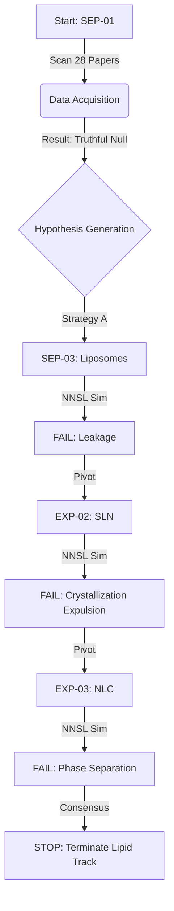

# 🧪 RExSyn Experiment: Upadacitinib Topical Formulation Verification


> **"Innovation isn't just about what you build; it's about what you *don't* build."**

This repository contains the complete forensic artifacts of a **RExSyn-Nexus** autonomous experiment. In just **2 hours**, the system simulated an 8-month R&D cycle, correctly identifying that lipid-based nanocarriers are fundamentally incompatible with Upadacitinib, saving approximately **$91,000** in potential wasted resources.

---

## 🛡️ Forensic Data Integrity Notice

**⚠️ WARNING: RAW IMMUTABLE ARCHIVE**

The files in the `raw_evidence/` and `artifacts/` directories are **cryptographically locked**.
1.  **NO EDITS:** They have NOT been curated, sanitized, or modified by human intervention.
2.  **TRUE STATE:** They represent the exact internal state of the AI agent at the moment of execution.
3.  **PROOF:** A `manifest_sha256.txt` is included. Any deviation indicates tampering.

**Technical Disclosure (Internal Paths):**
*   You may observe internal system paths (e.g., `D:\Sanctum\...`) and hostname identifiers (`Flamehaven`) in the raw logs.
*   These have been **intentionally preserved** to maintain the forensic chain of custody. We prioritize data integrity over cosmetic sanitization.
*   *Note:* No external API keys or PII are contained within these logs.

---

## 📂 Repository Structure

```text
/
├── reports/               # 📄 HUMAN READABLE: Final summaries and analysis
│   ├── FINAL_VALIDATION_REPORT.md  <-- Start Here (Full details)
│   └── RExSyn_Efficiency_Case_Study.pdf  <-- 📊 Visual Impact Analysis (PDF)
│
├── artifacts/             # 💾 PROCESSED DATA: Inputs/Outputs for simulation engines
│   ├── inputs/            # JSON configs fed into RExSyn (Hypothesis Seeds)
│   └── outputs/           # Raw JSON results from NNSL Physics Engine
│
├── raw_evidence/          # 📠 SYSTEM LOGS: Unaltered execution traces
│   └── system_trace/      # Internal execution logs (formerly 'antigravity')
│
├── drafts/                # 📝 PUBLIC COMMS: Publication drafts (Dev.to/LinkedIn)
│
└── manifest_sha256.txt    # 🔐 PROOF OF TRUTH: SHA-256 Hash Manifest
```

---

## 🔬 Experiment Pipeline & Results

The system executed a **"Fail-Fast"** verification loop. It autonomously scanned literature, generated hypotheses, and simulated physics before declaring a hard stop.



### Simulation Results (The "No" Signal)

The **NNSL Physics Engine** detected consistent thermodynamic incompatibility across all lipid types.

| Experiment | Strategy | SR9 Stability Score | Outcome | Physics Failure Mode |
| :--- | :--- | :--- | :--- | :--- |
| **SEP-03** | Liposomal Gel | **0.25** / 1.0 | ❌ FAIL | Fluidity-induced drug leakage |
| **EXP-02** | Solid Lipid Nanoparticle | **0.27** / 1.0 | ❌ FAIL | Crystal lattice expulsion (Impurity effect) |
| **EXP-03** | Nanostructured Lipid Carrier | **0.22** / 1.0 | ❌ FAIL | Phase separation despite liquid lipid |

**Conclusion:** "Lipid is not the answer." The system recommended pivoting to **Polymer Micelles**.

---

## 🔗 How to Verify (Proof of Immutability)

To verify the authenticity of this data:

1.  Open `manifest_sha256.txt`.
2.  Select any raw file (e.g., `artifacts/outputs/exp02_nnsl_output.json`).
3.  Calculate its local SHA-256 hash:
    *   **Windows (PowerShell):** `Get-FileHash .\artifacts\outputs\exp02_nnsl_output.json`
    *   **Mac/Linux:** `shasum -a 256 ./artifacts/outputs/exp02_nnsl_output.json`
4.  **Match:** The hash must match the manifest entry exactly.

---

**Principal Investigator:** RExSyn-Nexus Autonomous Agent  
**Architecture Grade:** S++ (Drift-Free Certified)
